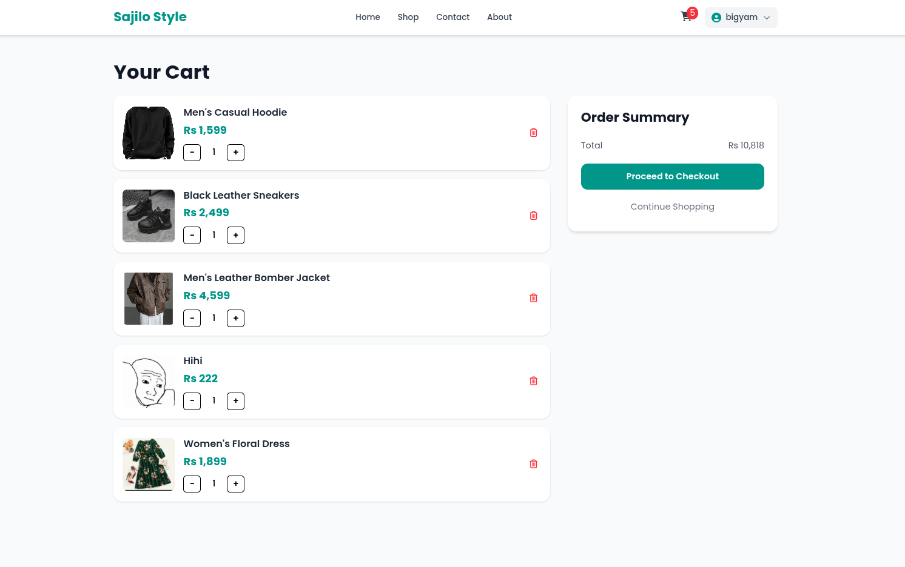
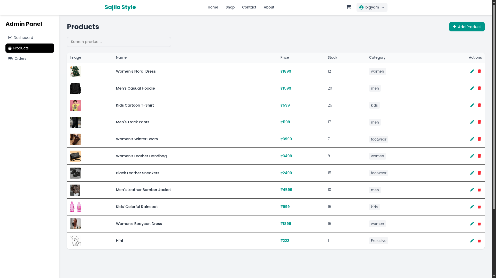

# E-Commerce Project

This project is a full-stack e-commerce platform designed specifically for **local fashion and clothing shops** who want to modernize their business with a clean, responsive, and professional online store.

It provides a complete solution for showcasing products, managing orders, and handling inventory through an intuitive admin dashboard. The goal is to help small businesses establish a strong digital presence with a modern UI and smooth user experience.

---

## Previews 

### Home Page


### Product Page


### Cart Page


### Admin Dashboard


### Admin Product Dashboard


---

## Features

### User Side
- User registration & login (JWT authentication)
- Browse products
- View product details
- Add to cart
- Place orders
- View order history

### Admin Panel
- Admin dashboard
- Add / Edit / Delete products
- Upload product images (Cloudinary)
- Manage orders
- Update order status (Pending → Shipped → Delivered)

---

## Tech Stack

### Frontend
- React
- React Router
- Tailwind CSS
- Axios

### Backend
- Node.js
- Express.js
- MongoDB + Mongoose
- JWT Authentication
- Multer (file handling)
- Cloudinary (image storage)

---

## Project Structure

### Backend
```
server/
├── src/
│   ├── config/
│   ├── controllers/
│   ├── middlewares/
│   ├── models/
│   ├── routes/
│   ├── services/
│   ├── types/
│   ├── utils/
│   └── index.ts
```
### Frontend
```
client/
├── src/
│   ├── api/
│   ├── components/
│   ├── context/
│   ├── layouts/
│   ├── pages/
│   ├── routes/
│   ├── App.jsx
│   ├── index.css
│   └── main.tsx
```

---

## ⚙️ Installation & Setup

### 1️⃣ Clone Repository
```bash
git clone https://github.com/bizzyumK/Ecommerce.git
cd Eecommerce
```
### 2️⃣ Backend Setup
```bash
cd server
npm install
```
#### ️Create .env file:
```bash
PORT=5000
DATABASE_URL=your_mongodb_url
JWT_SECRET=your_secret
TOKEN_EXPIRES_IN=7d
FRONTEND_URL=http://localhost:5173

CLOUDINARY_CLOUD_NAME=your_cloud_name
CLOUDINARY_API_KEY=your_api_key
CLOUDINARY_API_SECRET=your_api_secret
```

#### ️Run Backend:
```bash
npm run dev
```

### 3️⃣ Frontend Setup
```bash
cd client
npm install
```
#### ️Create .env file:
```bash
VITE_BACKEND_URL=http://localhost:5000
```
#### ️Run Frontend:
```bash
npm run dev
```
---

##  Image Upload Flow (Cloudinary)

- Admin selects images in frontend  
- Images sent via FormData  
- Backend receives files using multer  
- Files uploaded to Cloudinary  
- Cloudinary returns:
  - url  
  - public_id  
- Stored in MongoDB  
- Used for rendering products  

---

## API Endpoints

### Auth

| Method | Endpoint | Description |
|--------|----------|-------------|
| POST | /api/auth/register | Register new user |
| POST | /api/auth/login | Login user |

---

### Products

| Method | Endpoint | Description |
|--------|----------|-------------|
| GET | /api/product | Get all products |
| GET | /api/product/:id | Get single product |
| POST | /api/product (Admin) | Create new product |
| PUT | /api/product/:id (Admin) | Update product |
| DELETE | /api/product/:id (Admin) | Delete product |

---

### Orders

| Method | Endpoint | Description |
|--------|----------|-------------|
| POST | /api/order | Create order |
| GET | /api/order/my | Get user orders |
| GET | /api/order (Admin) | Get all orders |
| PUT | /api/order/:id (Admin) | Update order status |

## Admin Features

Only admin users can:

- Manage products  
- Upload images  
- Update order status  
- Delete products  

---

## Key Concepts Learned

- REST API design  
- JWT authentication  
- File upload with Multer  
- Cloudinary integration  
- React admin dashboard design  
- CRUD operations with MongoDB  
- State management in React  

---
<!--  -->
## Future Improvements

- Payment gateway integration (Stripe / Khalti)  
- Product filtering & sorting  
- Pagination  
- Email notifications  
- Order tracking system  
- Better image optimization  

---

## Author

Built by Bigyam Karmacharya